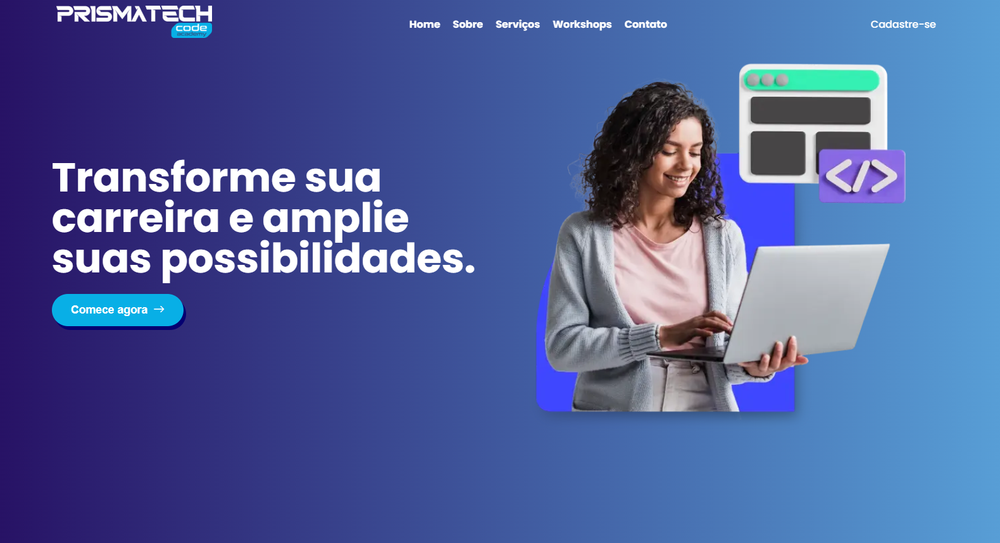

# PrismaTech Code Academy

Este é um projeto desenvolvido com [Next.js](https://nextjs.org), utilizando tema escuro e um design moderno para uma plataforma de cursos online.



---

## 🚀 Tecnologias Utilizadas

- **Next.js**: Framework React para SSR e SSG.
- **React**: Biblioteca para construção de interfaces de usuário.
- **Styled Components**: Estilização de componentes com CSS-in-JS.
- **TypeScript**: Tipagem estática para JavaScript.
- **Splide.js**: Criação de carrosséis e sliders responsivos.

---

## 📁 Estrutura do Projeto

```
src/
├── app/
│   ├── layout.tsx         # Layout principal
│   ├── page.tsx           # Página inicial
│   └── globals.css        # Estilos globais
├── components/            # Componentes reutilizáveis
├── assets/                # Imagens e ícones
├── @types/                # Tipagens personalizadas
├── mocks/                 # Dados mockados
├── interfaces/            # Interfaces TypeScript
└── designSystem.ts        # Sistema de design com cores e estilos
```

---

## 💡 Funcionalidades

- **Tema Escuro** com cores definidas no `designSystem.ts`.
- **Seções Dinâmicas** na página inicial:
  - Hero Section
  - Diferenciais
  - Cursos Disponíveis
  - Depoimentos
  - Contatos
- **Loader Simulado** durante o carregamento da página.

---

## ▶️ Como Executar o Projeto

1. Clone o repositório:
   ```bash
   git clone https://github.com/seu-usuario/seu-repositorio.git
   cd seu-repositorio
   ```

2. Instale as dependências:
   ```bash
   npm install
   ```

3. Inicie o servidor de desenvolvimento:
   ```bash
   npm run dev
   ```

4. Acesse no navegador:
   ```
   http://localhost:3000
   ```

---

## 📜 Scripts Disponíveis

- `dev`: Inicia o servidor de desenvolvimento.
- `build`: Gera a build de produção.
- `start`: Inicia o servidor de produção.
- `lint`: Executa o linter.

---

## 🎨 Sistema de Design

O sistema de design está em `designSystem.ts` com:

- Paleta de cores (primárias, secundárias, gradientes).
- Cores específicas para componentes.
- Estilos para redes sociais (Facebook, Instagram, YouTube).

---

## 🌐 Estilos Globais

No arquivo `globals.css`:

- Fonte principal: **Poppins**.
- Estilização base de botões, títulos e layout.

---

## 🚀 Deploy

O projeto pode ser implantado facilmente na [Vercel](https://vercel.com), a plataforma oficial do Next.js.

---

## 🤝 Contribuição

Contribuições são bem-vindas! Para contribuir:

1. Faça um fork do repositório.
2. Crie uma branch para sua feature:
   ```bash
   git checkout -b minha-feature
   ```
3. Faça commit das suas alterações:
   ```bash
   git commit -m "Minha nova feature"
   ```
4. Envie para seu fork:
   ```bash
   git push origin minha-feature
   ```
5. Abra um **Pull Request**.

---

## 📄 Licença

Este projeto está licenciado sob a **MIT License**.

---

## Autor

[Wallace Vieira](https://wallacevieira.vercel.app)  
Desenvolvedor Fullstack e gamer.
